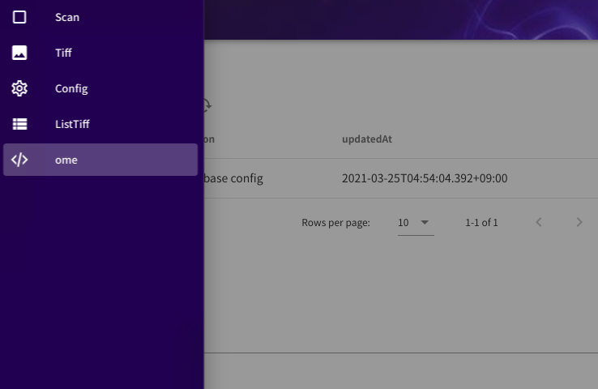
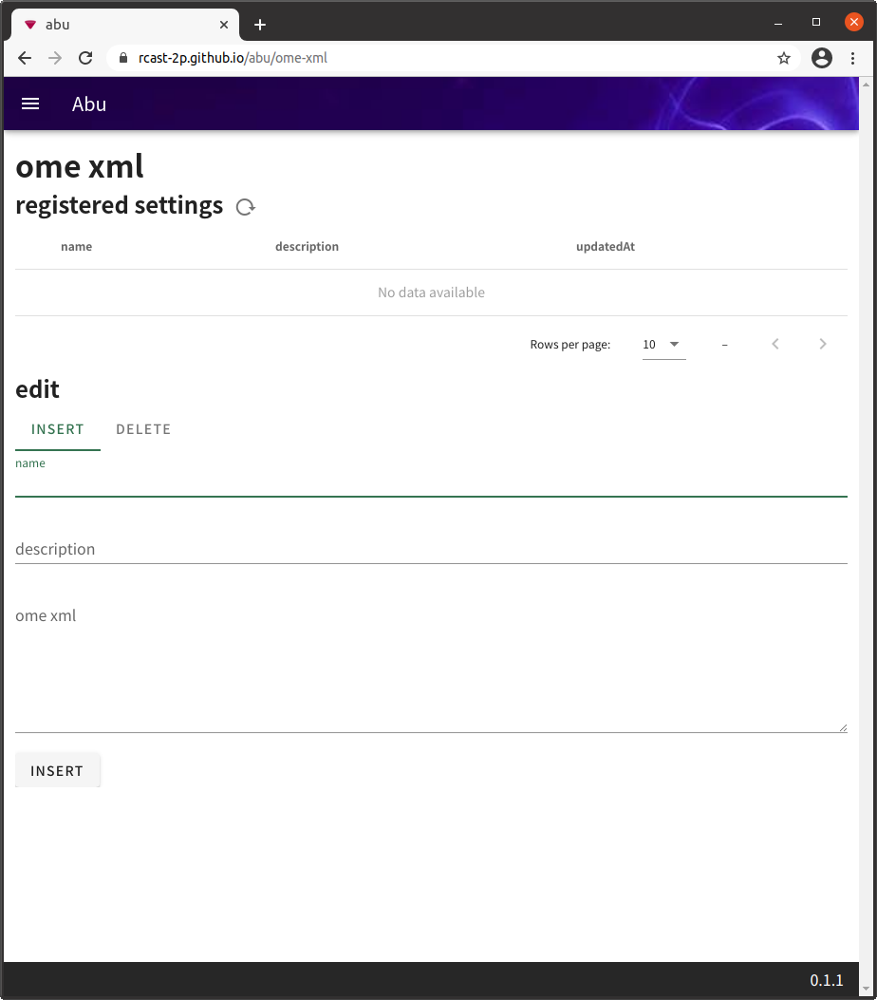
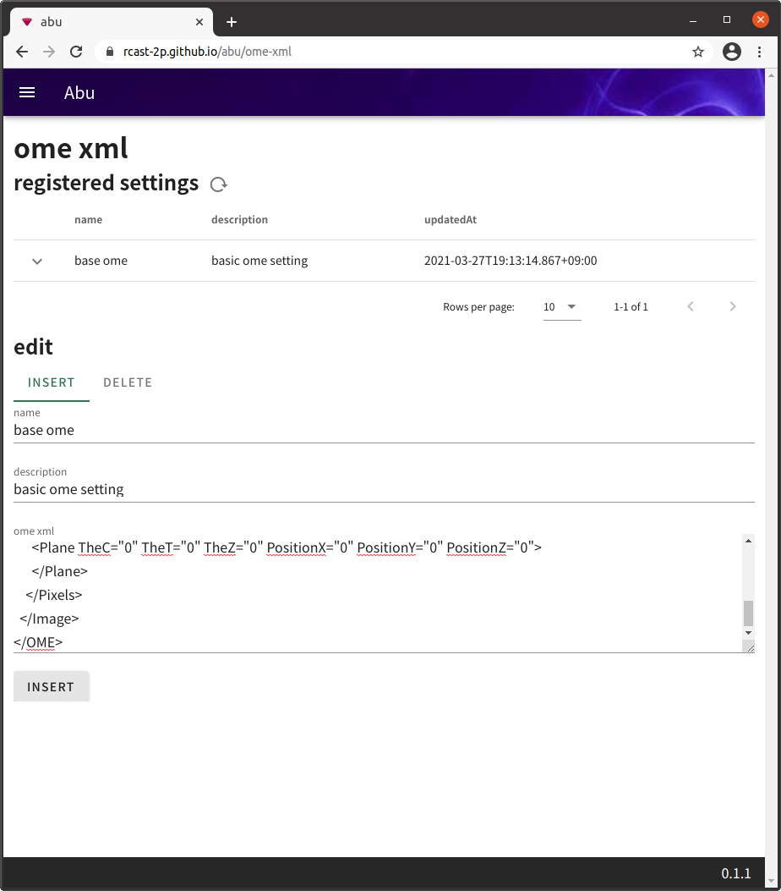
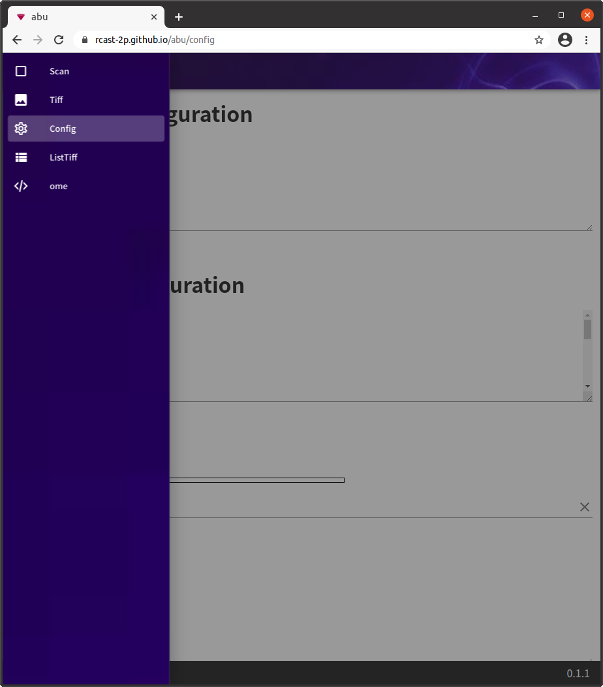
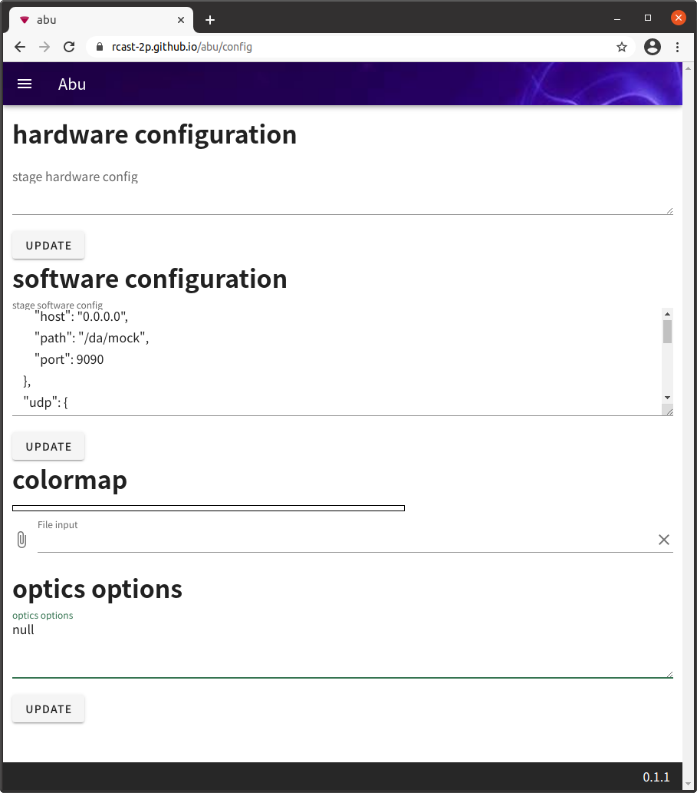

# usage

## initial setup

### allow mixed contents

If you want to use https://rcast-2p.github.io/abu/ you need to enable mixed content to access `http` (non `https`) API.
- [How Do I Enable Mixed Content in My Browser? | Adobe Target](https://experienceleague.adobe.com/docs/target/using/experiences/vec/troubleshoot-composer/mixed-content.html?lang=en#task_FF297A08F66E47A588C14FD67C037B3A)
Or you can build the source by yourself or get the product of build and run it on `docker nginx server` or equivalent server.

### base ome xml

Select `ome` from sidemenu.

Register base ome xml. You can find sample ome xml from https://github.com/rcast-2p/aladdin/blob/master/abu_js/doc/samples/sample.ome.xml or `synapse2:/home/common/ResearchProjects/00two-photon/abu/samples/kanzaki_lab.sample.ome.xml`

Push `INSERT` button.

### Hardware configuration and etc

Select `config` from sidemenu.

You can skip software configuration.

samples are here.

- hardware configuration  
https://github.com/rcast-2p/aladdin/blob/master/abu_js/doc/samples/hardware_configuration_sample.json
- colormap  
https://github.com/rcast-2p/aladdin/blob/master/abu_js/doc/samples/colormap_sample.txt
- optics options  
https://github.com/rcast-2p/aladdin/blob/master/abu_js/doc/samples/optics_options_sample.json or 
`sypanse2:/home/common/ResearchProjects/00two-photon/abu/samples/kanzaki_lab_optics_options.json`
